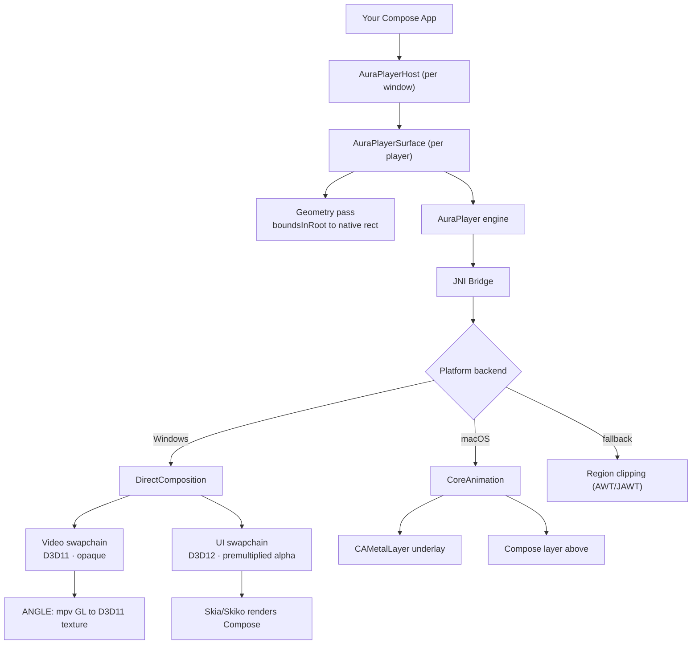

# AuraPlayer

**AuraPlayer** is a high-performance **cross-platform desktop media playback engine written in Kotlin**.

It bridges the JVM with native GPU compositors => **DirectComposition** on Windows and
**CoreAnimation** on macOS so video frames are composited directly alongside your desktop UI and
never round-trip through the JVM.

AuraPlayer supports **both audio and video playback** and is designed to be embedded into JVM desktop
applications while maintaining hardware-accelerated performance.

The project exists to fill a gap in the JVM ecosystem: there was no modern desktop media engine
comparable in capability to players like ExoPlayer that still integrated cleanly with desktop UI
frameworks.

---

## Screenshots

| Player with controls                                          | Settings popover                                                |
|---------------------------------------------------------------|-----------------------------------------------------------------|
|  |  |

---

## What makes it different

Most JVM video solutions paint frames into an AWT component, which forces a choice: either the video
is on top and nothing can overlay it, or you pay to copy every frame back through the JVM.

AuraPlayer does neither. It inserts a **native compositor layer** behind your UI. Video and UI are
two independent GPU surfaces, blended by the OS compositor — so controls, subtitles and popups draw
above the video with correct alpha, at full frame rate, with no flicker and no
heavyweight/lightweight mixing problems.

- Hardware-accelerated decoding
- Zero-copy GPU rendering pipeline
- Native compositor integration on Windows and macOS
- Audio-only playback supported
- Most common containers and codecs *(depending on native backend support)*

---

## Modules

| Module | Purpose |
|---|---|
| **`auraplayer-core`** | The playback engine — media pipeline, JNI bridge, native rendering, decoding. No UI framework dependency. Use it with Swing, JavaFX, LWJGL, or your own renderer. |
| **`auraplayer-compose`** | Compose Desktop integration — video surface composable, player controls, overlay support. Includes core. |

**Getting started, installation and usage live in the module docs:**
→ [`auraplayer-compose/README.md`](auraplayer-compose/README.md)

---

## Architecture

AuraPlayer composites video and UI as **two separate native layers**. The video layer is owned by the
engine; the UI layer receives your Compose content rendered by Skia. The compositor blends them —
neither layer knows the other exists.



### Windows — DirectComposition

The primary path. At init AuraPlayer creates a D3D11 device, a DirectComposition device, and a
visual tree targeting the window:

```
root_visual
├── video_visual   ← D3D11 swapchain, opaque
└── ui_visual      ← D3D12 swapchain, premultiplied alpha (drawn above)
```

The target is created **topmost**, so the tree composites in front of the window's AWT-painted
content.

**Video path.** mpv renders through **ANGLE**, initialized over AuraPlayer's *own* D3D11 device — so
mpv's OpenGL output and the swapchain live on a single device with no cross-device interop. mpv draws
into an EGL pbuffer backed by a D3D11 texture, which is copied to the swapchain backbuffer and
presented. A dedicated render thread drives this, waking on mpv's update callback or on a pending
resize.

**UI path.** A second swapchain with premultiplied alpha is wrapped as a Skia
`BackendRenderTarget`; Compose renders your controls straight into its backbuffer. Transparent pixels
let the video show through.

**Geometry.** `onGloballyPositioned` reports the surface's `boundsInRoot`, which is converted to
physical pixels and pushed to the native visual offsets.

### macOS — CoreAnimation

A `CAMetalLayer` is inserted **beneath** the Compose layer in the window's layer hierarchy, and its
frame tracks the surface as it moves and resizes. Z-order is set once at init; there is no per-frame
compositing work on the JVM side.

### Fallback — region clipping

Where DirectComposition is unavailable, AuraPlayer falls back to the legacy approach: an AWT `Canvas`
in the layered pane with a hole cut in the Skiko surface via `SetWindowRgn`. This is the **JAWT**
path. It works, but overlays are not possible — UI cannot be drawn above video.

### Rendering flow

```
Compose layout (boundsInRoot)
        ↓
Geometry pass → native rect (physical px)
        ↓
JNI Bridge
        ↓
Compositor visual tree
        ↓
┌───────────────┬────────────────┐
│ Video layer   │ UI layer       │
│ mpv → ANGLE   │ Compose → Skia │
│ → D3D11       │ → D3D12        │
└───────────────┴────────────────┘
        ↓
GPU compositor output
```

---

## Requirements

| | Minimum |
|---|---|
| JDK | 21 (JetBrains Runtime recommended) |
| Kotlin | 2.2.20 |
| Compose Multiplatform | 1.10.0-rc01 |
| OS | Windows 10 1809+ / macOS 11+ |

Windows additionally requires a Direct3D 11 capable GPU (feature level 11_0).

Native libraries — `libmpv-2.dll`, `libEGL.dll`, `libGLESv2.dll` — are bundled in the jar and
extracted at first launch. mpv does not need to be installed separately.

---

## Current limitations

- One DirectComposition-backed player per window (others fall back to region clipping)
- Maximum 16 surfaces per window
- HDR output is detected but not yet enabled — the swapchain is currently 8-bit

---

## License

<!-- TODO -->