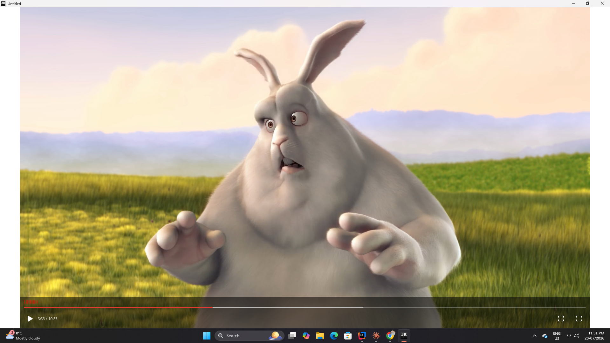
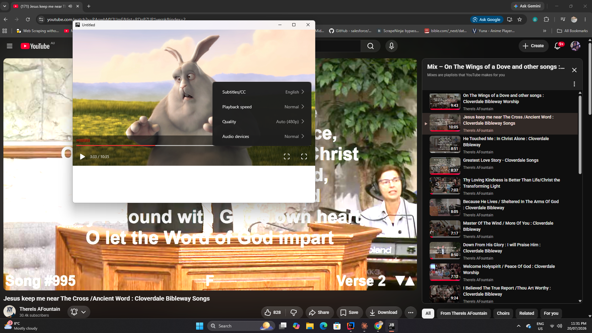

# AuraPlayer

A hardware-accelerated video player for **Compose Multiplatform Desktop**, backed by libmpv.

Video is composited *beneath* your Compose UI using native surfaces => DirectComposition on Windows,
CAMetalLayer on macOS so overlays, control bars and popups draw on top of the video with no
flicker, no z-order hacks, and no heavyweight/lightweight mixing problems.

---

## Screenshots

| Player with controls                       | Settings popover                             |
|--------------------------------------------|----------------------------------------------|
|  |  |

> Screenshots live in `sr/main/screenshots/`. Rename the files above to match what's actually in that folder.

---

## Requirements

| | Minimum |
|---|---|
| JDK | 21 (JetBrains Runtime recommended — JBR 21.0.11+) |
| Kotlin | 2.2.20 |
| Compose Multiplatform | 1.10.0-rc01 |
| OS | Windows 10 1809+ / macOS 11+ |

**Windows** additionally needs a GPU supporting Direct3D 11 (feature level 11_0). Practically every
GPU from the last decade qualifies.

Native libraries — `libmpv-2.dll`, `libEGL.dll`, `libGLESv2.dll` — are **bundled inside the jar** and
extracted to a cache directory at first launch. You do not need to install mpv separately.

---

## Installation

AuraPlayer ships as two modules. `auraplayer-core` is the engine; `auraplayer-compose` adds the
Compose integration. Most projects want both.

### Gradle (Kotlin DSL)

```kotlin
repositories {
    mavenCentral()
}

dependencies {
    implementation("com.mossi:auraplayer-core:0.1.6")
    implementation("com.mossi:auraplayer-compose:0.1.6")
}
```

### Gradle (Groovy)

```groovy
dependencies {
    implementation 'com.mossi:auraplayer-core:0.1.6'
    implementation 'com.mossi:auraplayer-compose:0.1.6'
}
```

### Building from source

```bash
git clone https://github.com/M0ssi-P/AuraPlayer.git
cd AuraPlayer
./gradlew publishToMavenLocal
```

then add `mavenLocal()` to your `repositories` block.

Rebuilding the **native** layer additionally requires a C/C++ toolchain:

- **Windows** — [w64devkit](https://github.com/skeeto/w64devkit) on `PATH`
- **macOS** — Xcode command line tools (`xcode-select --install`)

---

## Quick start

Two things are required: wrap your window content in `AuraPlayerHost`, and place an
`AuraPlayerSurface` somewhere inside it.

```kotlin
fun main() = application {
    Window(onCloseRequest = ::exitApplication) {
        val engine = remember { AuraPlayer() }

        // 1. Host must wrap your content and receive the ComposeWindow
        AuraPlayerHost(window) {
            Column(Modifier.fillMaxSize()) {

                // 2. Nest the surface anywhere, at any depth.
                //    First composition attaches the native surface and initializes mpv.
                AuraPlayerSurface(
                    engine,
                    modifier = Modifier
                        .aspectRatio(16f / 9f)
                        .align(Alignment.CenterHorizontally),
                    controls = {
                        AuraControlBar(
                            engine,
                            modifier = Modifier.align(Alignment.BottomCenter),
                        )
                    }
                )
            }
        }

        LaunchedEffect(Unit) {
            engine.load("https://example.com/video.mp4")
            engine.play()
        }
    }
}
```

### Why `AuraPlayerHost` is mandatory

The host owns the native compositor tree and hands out surface slots (max 16 per window). Without it,
`AuraPlayerSurface` throws:

```
AuraPlayerSurface requires AuraPlayerHost at the root of your window.
```

It must receive the `ComposeWindow` — inside a `Window { }` block that's simply `window`.

---

## Controls

`AuraControlBar` gives you a working control bar out of the box, and every region is a slot you can
replace:

```kotlin
AuraControlBar(
    player = engine,
    segments = chapterList,
    seekBar  = { DefaultSeekBar(engine, segments = chapterList) },
    leading  = { PlayPause(engine); Spacer(Modifier.width(8.dp)); TimeLabel(engine) },
    trailing = { /* your buttons */ },
)
```

### Popovers over video

Because controls render into the video overlay layer, **`androidx.compose.ui.window.Popup` will not
position correctly** — it anchors to the overlay root (the video rect), not your window. Use the
bundled `PopoverAnchored`, which positions inline within the overlay's own coordinate space:

```kotlin
PopoverAnchored(
    popupModifier = Modifier
        .widthIn(min = 220.dp, max = 320.dp)
        .heightIn(max = 340.dp),
    hoverEnabled = true,
    gap = 12,
    popup = { state -> SettingsSheet(engine, onDismiss = { state.value = false }) }
) {
    IconButton(onClick = { }) { Icon(Settings, "Settings") }
}
```

It centres on the anchor, shifts inward on edge collision, and flips above/below depending on
available room.

---

## Overlay modes

```kotlin
engine.setOverlayMode(OverlayMode.OVER_VIDEO)   // Compose UI draws on top of video
engine.setOverlayMode(OverlayMode.BESIDE_VIDEO) // video is a plain opaque region
```

`OVER_VIDEO` is what you want for player controls.

---

## Platform backends

| Platform | Video path | UI path |
|---|---|---|
| Windows | DirectComposition visual + D3D11 swapchain, mpv rendered through ANGLE | Second premultiplied-alpha swapchain composited above |
| macOS | `CAMetalLayer` underlay beneath the Compose layer | Native layer z-order |

On Windows you can force the legacy region-clipping backend if DirectComposition misbehaves on a
particular driver:

```kotlin
auraWindowsBackend = WinVideoBackend.REGION
```

Set this **before** the first `AuraPlayerSurface` composes. Only one player per window may own the
DirectComposition tree; additional surfaces in the same window fall back to `REGION` automatically.

---

## Fullscreen

```kotlin
engine.toggleFullscreen()          // surface fills the window
engine.setWindowFullscreen(true)   // borderless fullscreen on the monitor
```

Borderless fullscreen intentionally sizes the window **one pixel taller than the monitor**. This
prevents Windows from enabling fullscreen optimizations / independent flip, which bypasses the
DirectComposition tree and blanks the overlay. The extra row is off-screen and never visible.

---

## Troubleshooting

**Video is black around the edges after resizing while paused**
Fixed in 0.1.6. The render thread now forces a repaint after a swapchain resize instead of waiting
for a new decoded frame. If you're on an older build, resuming playback clears it.

**NVIDIA "Press Alt+Z" overlay appears**
NVIDIA injects `nvspcap64.dll` and detects any process presenting via DXGI as a game. Harmless.
Disable the in-game overlay in the NVIDIA App, or add an exclusion for `java.exe`.

**Popup / dropdown renders at the top-left corner**
You're using `androidx.compose.ui.window.Popup` inside the video overlay. See
[Popovers over video](#popovers-over-video).

**`UnsatisfiedLinkError` on startup**
The bundled natives failed to extract. Check write access to the temp directory, and confirm your
antivirus isn't quarantining `libmpv-2.dll`.

**Crash in `uiAcquireBackbuffer` on window close**
Fixed in 0.1.6 — a queued render could fire after native teardown.

---

## Known limitations

- One DirectComposition-backed player per window (others fall back to `REGION`)
- Maximum 16 surfaces per window
- HDR output is detected but not yet enabled — the swapchain is currently 8-bit
- No true backdrop blur behind overlays; Compose Desktop has no backdrop-blur modifier

---

## License

<!-- TODO -->